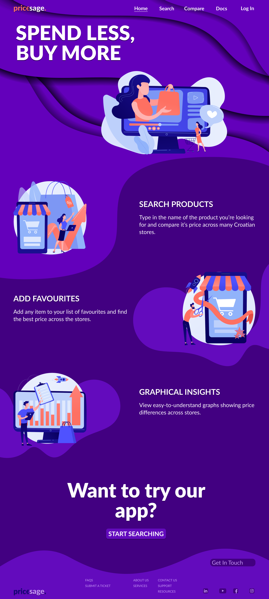

# Full Responsive Page Coding

## Overview

This assignment involves creating high-fidelity prototypes of our application, both desktop and mobile versions. We used Figma to create our prototypes and implemented them in our application. The prototypes were already created in the previous assignments, so we just had to implement some changes and bug fixes. In this readme you can find the link to our application (the application will look slightly different because of bug fixes and changes) and also resources from previous assignments.

We hope you enjoy our application! 😊

## Home Page

This is home page of our application. It shows quick summary of our application. Images and texts are fetched from Contentful CMS.

    

## Mobile Version

This is mobile version of our application. It is responsive and looks good on different devices. It also has mobile navigation hamburger menu.

    

## Notes

We are still thinking about different design for mobile version. We will continue updating the design as we move forward.

## Link to our page

[App on Vercel](https://hci-bay.vercel.app)
