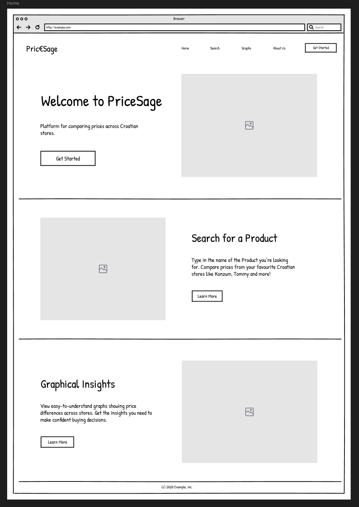
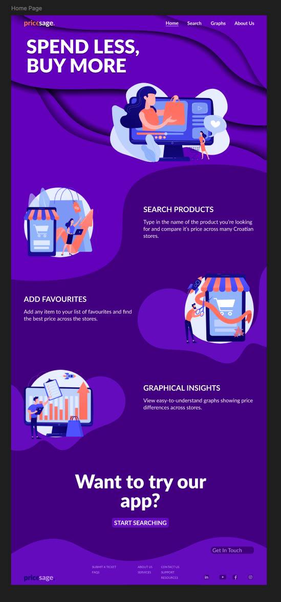
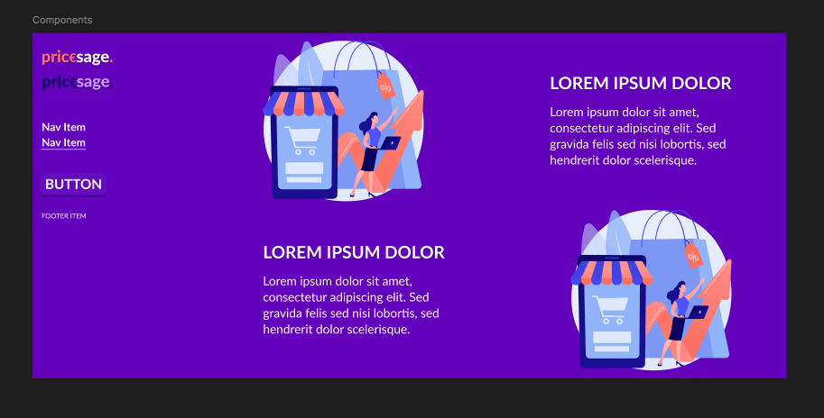

# Low/High Fidelity Prototype

## Introduction

This assignment involves using Figma to design a low or high-fidelity prototype for the landing/home page of our web application. We applied fundamental design principles such as consistency, readability, and visual hierarchy to create an aesthetically pleasing and user-friendly interface.

We have uploaded pictures of our low and high-fidelity prototypes to the repository, along with a README file explaining the design process and the rationale behind our design choices.

We hope you enjoy our design! 😊

## Design Process

We began with a low-fidelity wireframe model to determine the best placement of elements on our web page. This allowed us to quickly iterate on different layouts and gather feedback from potential users.

Once satisfied with the wireframe, we created a high-fidelity prototype, adding more details, colors, and interactions to better represent the final product.

  

For the high-fidelity prototype, we focused on creating a clean and modern design that would appeal to our target audience. We used a simple color palette (shades of purple) and typography to create a cohesive look and feel. Subtle animations and interactions were added to make the prototype more engaging and interactive. The design is evenly spaced and aligned to create a visual hierarchy and guide the user's eye through the page.

  

In the second version, we only changed the navigation in the navbar and left-aligned the content by utilizing CRAP alignment principles. We removed the "About Us" navigation to avoid redundancy. We will continue updating the design as we move forward.

  

Here are the components used in the design:

  

