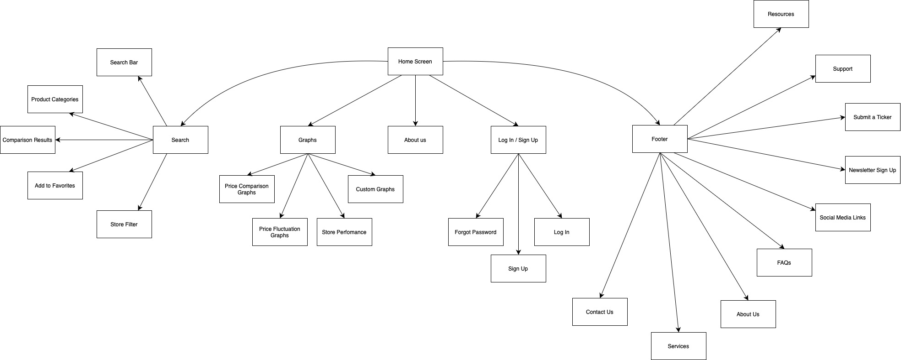

# User personas and information architecture

## Introduction

The task for this assignment is to create user personas and develop an information architecture for a specific project. User personas are fictional characters created to represent the different user types that might use a site, brand, or product in a similar way. Information architecture is the structural design of shared information environments, such as websites and software applications, to support usability and findability. Sitemaps are used to visualize the structure and hierarchy of information on a website.

We've created a set of 3 user personas relevant to our project. We've also developed an information architecture based on the card sorting method and created a sitemap for our web application. ChatGPT prompts are also included.

We hope you like it! 😊 (ChatGPT and Copilot say hi!!!)

## Personas

### Prompt 
I am working on a web page, which should gather Croatia's grocery stores prices, allowing  user to search the product as desired (also add it to personal list of favourites) and compare the price of product among the Croatia's grocery stores. Web page should also provide graphs, which should provide price differences across stores. 

Create a set of user personas (3) relevant to a this project. These personas should represent the target audience for the web page. Include variety of demographic details, personality traits, and context-specific information.

### Personas

#### Persona 1: Marko Lovrenčić

<table>
    <tr>
        <td></td>
        <td>
            • Age: 45 
            • Occupation: Teacher 
            • Location: Osijek, Croatia 
            • Household: Married with two children 
            • Income: Middle-to-Low income bracket 
            • Tech Comfort Level: Moderate 
        </td>
    </tr>
</table>

**Personality Traits**

- **Family-Oriented:** Marko is focused on providing for his family and is very conscious about spending on groceries and other household items.
- **Value-Conscious:** He prioritizes quality-to-price ratio, especially for household staples like dairy, bread, and produce.
- **Traditional Shopper:** Prefers well-known brands but is open to exploring store-brand options if they're well-reviewed.

**Motivations**
- **Budget Management:** Marko aims to keep grocery costs predictable and within budget, especially with two kids.
- **Discount Hunting:** Often looks for promotions and discounts, especially for family-sized packs and essentials.
- **List Building:** Sees value in creating a grocery list he can manage weekly based on updated prices.

**Pain Points**
- **Time Constraints:** With his teaching job, Marko has limited time to research prices or visit multiple stores.
- **Price Hikes:** Struggles with rising grocery costs and unexpected price changes that strain the family budget.
- **Limited Options in Smaller Stores:** Local stores may have limited stock, making it important to know which store has the best prices before he drives there.

**Goals on the Web Page**
- **Creating a Weekly Shopping List:** Marko wants a feature to add weekly grocery items to a favorites list and view any price changes.
- **Savings Alerts:** He’d benefit from alerts when prices on key items drop in nearby stores.
- **Simple Price Comparison:** Prefers a simple and straightforward way to compare prices without much data complexity, ideally through clear graphs or side-by-side comparisons.

#### Persona 2: Ana Radman
<table>
    <tr>
        <td></td>
        <td>
            • Age: 27 
            • Occupation: Freelance Graphic Designer 
            • Location: Split, Croatia 
            • Household: Single 
            • Income: Lower-middle income bracket 
            • Tech Comfort Level: High 
        </td>
    </tr>
</table>

**Personality Traits**
- **Health-Conscious:** Ana is very particular about the quality of groceries and prefers organic or specialty products.
- **Eco-Friendly:** Values sustainability and tends to shop at stores that offer eco-friendly products.
- **Flexible Shopper:** Her freelance schedule gives her the flexibility to shop at less busy times or to visit multiple stores for better prices.

**Motivations**
- **Quality and Value:** She wants to find affordable, high-quality items, balancing price with nutritional and environmental considerations.
- **Product Variety:** Interested in niche products, such as vegan or gluten-free options, and values a platform that shows price variations across multiple stores.
- **Personalized Experience:** Prefers a highly personalized interface where she can filter for her specific preferences, like organic or sustainable brands.

**Pain Points**
- **Lack of Transparency in Niche Products:** Hard to find price comparisons for niche items, especially when their availability varies.
- **Price Variability:** Frustrated by fluctuating prices, especially on specialty items.
- **Difficulty Tracking Expenses:** Ana often goes over her grocery budget and wants an easy way to track her spending across different stores.

**Goals on the Web Page**
- **Detailed Product Filtering:** Ana would like to filter by product type (organic, vegan, etc.) to see availability and price range across stores.
- **Favorites List for Specific Diets:** She wants to build a list that aligns with her dietary preferences and be alerted to any price drops.
- **Historical Price Trends:** Ana wants to use graphs to track how prices of niche products have changed over time and identify if any patterns emerge.

#### Persona 3: Josip Kovačić
<table>
    <tr>
        <td></td>
        <td>
            • Age: 68 
            • Occupation: Retired (Former Electrician) 
            • Location: Rijeka, Croatia 
            • Household: Lives alone 
            • Income: Fixed retirement income 
            • Tech Comfort Level: Basic 
        </td>
    </tr>
</table>

**Personality Traits**
- **Frugal:** Josip lives on a fixed income and is very careful with his spending, especially when it comes to essential items like groceries.
- **Routine-Oriented:** Prefers stability in his shopping habits and sticks to a familiar list of items.
- **Independent but Appreciative of Assistance:** He values tools that help him maintain his independence while simplifying daily tasks.

**Motivations**
- **Fixed Budgeting:** Josip needs to stick to a strict grocery budget each month and looks for ways to save money without sacrificing quality.
- **Simple Price Tracking:** Prefers to buy staples (like bread, milk, and produce) at the lowest possible prices, without needing to navigate complex data.
- **Convenience:** Appreciates a simple tool that lets him track prices without physically visiting multiple stores.

**Pain Points**
- **Rising Cost of Living:** Inflation impacts his fixed income, so even small price changes on essential goods affect his budget.
- **Tech Accessibility:** Prefers a straightforward, accessible interface with larger text and minimal navigation.
- **Difficulty with Promotions:** Finds it challenging to keep track of rotating discounts and promotions.

**Goals on the Web Page**
- **Favorites List for Essentials:** Josip would like a feature where he can save frequently purchased items, making it easy to check their current prices without having to search every time.
- **Price Alerts for Staples:** He’d benefit from alerts on price drops or special promotions for core items he regularly buys, such as bread, milk, and produce.
- **Simplified Graphs:** Prefers visual representations of price changes, as long as they are simplified and easy to understand, allowing him to quickly identify which stores offer the best deals.

**Additional Accessibility Needs**
- **Large Fonts and Clear Labels:** Josip needs a larger, easy-to-read font and clear navigation to use the site comfortably.
- **Low Cognitive Load:** Prefers a clutter-free interface with an easy-to-find menu and minimal steps to reach important features like price comparisons and his favorites list.

## Information Architecture

### Prompt
Develop an information architecture for this project based on the card sorting method.

### Information Architecture

1. **Home**
    - **Application Info:** Information about application and it's functionalities.

2. **Search**
    - **Search Bar:** Centralized search functionality with auto-complete.
    - **Product Categories:** Browsable categories like Dairy, Produce, Bakery, etc.
    - **Comparison Results:** Organized price listings by store with filters.
    - **Add to Favorites:** Button to add items to favorites list.
    - **Store Filter:** Narrow results by specific stores.

3. **Graphs**
    - **Price Comparison Graphs:** Visual comparison of product prices across different stores.
    - **Price Fluctuation Graphs:** Graphs showing price changes over time for selected products.
    - **Store Performance:** Comparative graphs showing which stores offer the best prices over time.
    - **Custom Graphs:** User-generated graphs based on selected criteria like product type, store, or time period.

4. **About Us**
    - **About Us Info:** Overview of the website’s purpose, mission, vision, and values, including information about the team.

5. **Log In/Sign Up**
    - **Log In:** Form for existing users to log in.
    - **Sign Up:** Registration form for new users.
    - **Forgot Password:** Link to reset password.

6. **Footer Navigation**

    - **Submit a Ticket:** Link to a form where users can submit support tickets.
    - **FAQs:** Frequently Asked Questions section to help users find quick answers.
    - **About Us:** Link to the About Us page.
    - **Services:** Overview of the services offered by the website.
    - **Contact Us:** Contact form and information.
    - **Support:** Link to the support page for additional help.
    - **Resources:** Collection of useful resources and guides.
    - **Social Media Links:** Links to social media.
    - **Newsletter Sign-Up:** Form to subscribe to the newsletter via email.

## Sitemap

